# 🩻 Chest X-ray Pneumonia Detection

## 📄 Overview

This project is designed to classify **Chest X-ray images** into **NORMAL** or **PNEUMONIA** using deep learning techniques (CNN) in TensorFlow / Keras. The application includes an end-to-end pipeline from **data preprocessing, augmentation, model training, evaluation, visualization, and deployment via TFLite with Streamlit** for easy demo.

---

## 📂 Dataset

* Dataset Source: [Kaggle - Chest X-ray Pneumonia](https://www.kaggle.com/datasets/paultimothymooney/chest-xray-pneumonia)
* Classes:

  * **NORMAL**
  * **PNEUMONIA**

The dataset is structured into `train`, `val`, and `test` folders.

---

## 🔧 Steps Breakdown

### 1️⃣ **Data Preparation**

* **Images loaded from disk** and shuffled.
* **Labels extracted** from the folder structure.
* **Label encoding** applied via `LabelEncoder`.
* **Dataset split** into train/validation/test sets.
* **Exploratory visualization** of random X-ray samples.

---

### 2️⃣ **Preprocessing Pipeline**

Each image is:

* Resized to **512x512**.
* Converted to **3 channels**:

  * **Original (median filter)**
  * **Sobel edge detection**
  * **Canny edge detection**
* Normalized to **0-1 float32**.

---

### 3️⃣ **Data Augmentation**

Implemented custom augmentations:

* Random flips (horizontal, vertical)
* Random rotation
* Random crop & resize
* Random brightness & contrast changes
* Gaussian noise injection

---

### 4️⃣ **Data Generators**

Custom `Sequence` class (`MyDataGenerator`) supports:

* Parallel image loading
* On-the-fly augmentation
* Shuffling per epoch

---

### 5️⃣ **Model Architectures**

Three CNN architectures were designed:

| Model Name      | Architecture Type                                |
| --------------- | ------------------------------------------------ |
| `simple_cnn_v1` | Shallow CNN with small filters                   |
| `medium_cnn_v1` | Deeper CNN with more filters                     |
| `long_cnn_v1`   | CNN with multi-scale inputs (Concatenate branch) |

* All models use **BatchNormalization** and **AvgPooling**.
* Final layer: `softmax` with `sparse_categorical_crossentropy`.

---

### 6️⃣ **Training**

* **Class weights** computed to handle class imbalance.
* Training with:

  * `EarlyStopping`
  * `ReduceLROnPlateau`
  * `ModelCheckpoint`
  * **Custom History saving callback**
* Train & validation loss / accuracy plotted.

---

### 7️⃣ **Evaluation**

* Metrics: **Accuracy, Precision, Recall, F1-score**
* Visualization:

  * **Classification report heatmaps** (Train, Val, Test)
  * **Confusion matrices**

---

### 8️⃣ **Deployment**

* **Exported models to `.tflite`** using TensorFlow Lite.
* **Streamlit App**:

  * Upload image
  * Run prediction on-device via TFLite
  * Display class and confidence with colored indicators (green/red)

---

## 🚀 Running the Streamlit App

```bash
streamlit run streamlit_app.py
```

---

## 🖼️ Demo & Screenshots

### App Screenshot (Prediction Display)

### Image After Preprocessing
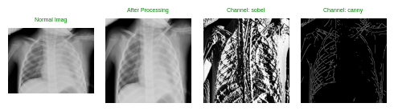

### Train Loss
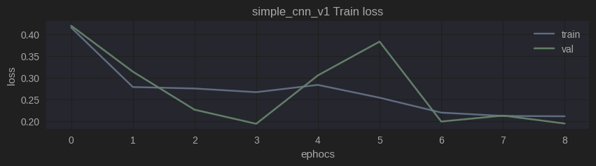
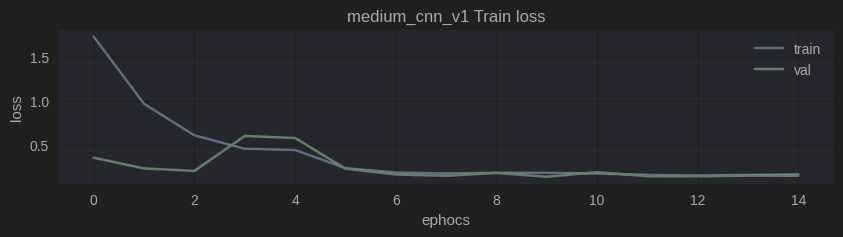
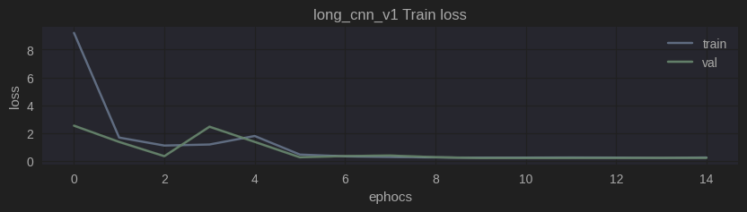

### Train Accuracy
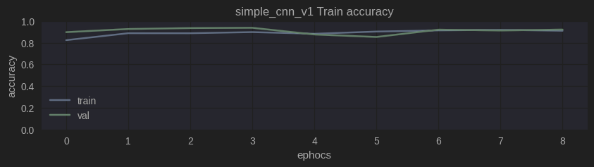
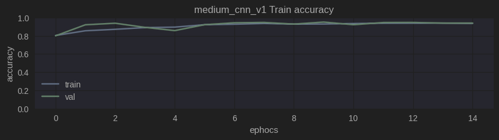
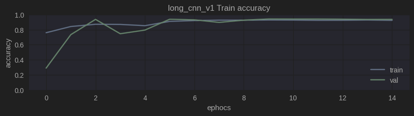

### Classification Report
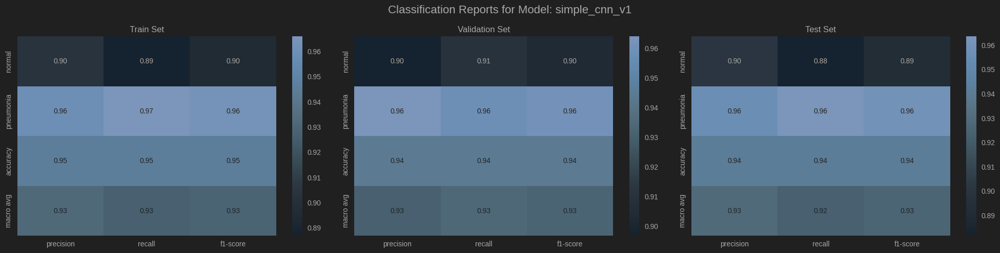
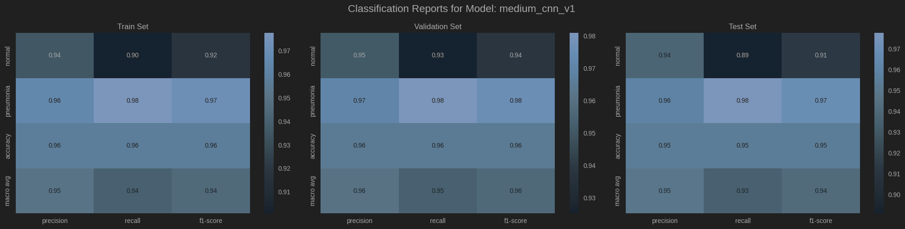
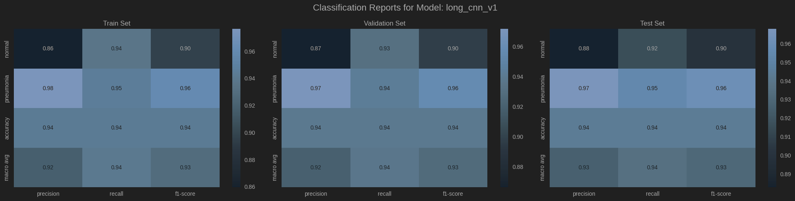

### Confusion Matrix
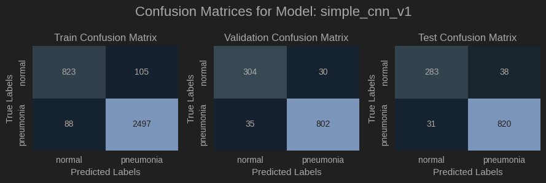
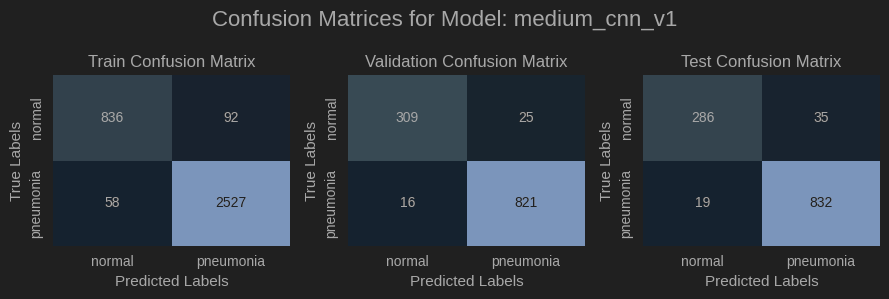
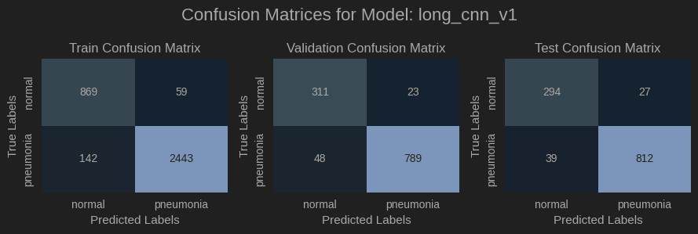
---

## 🛠️ Requirements

```bash
pip install tensorflow opencv-python streamlit seaborn scikit-learn matplotlib numpy
```

---

## 📊 Results

| Model Name      | Best Val Accuracy |
| --------------- |-------------------|
| simple\_cnn\_v1 | \94%              |
| medium\_cnn\_v1 | \96%              |
| long\_cnn\_v1   | \94%              |